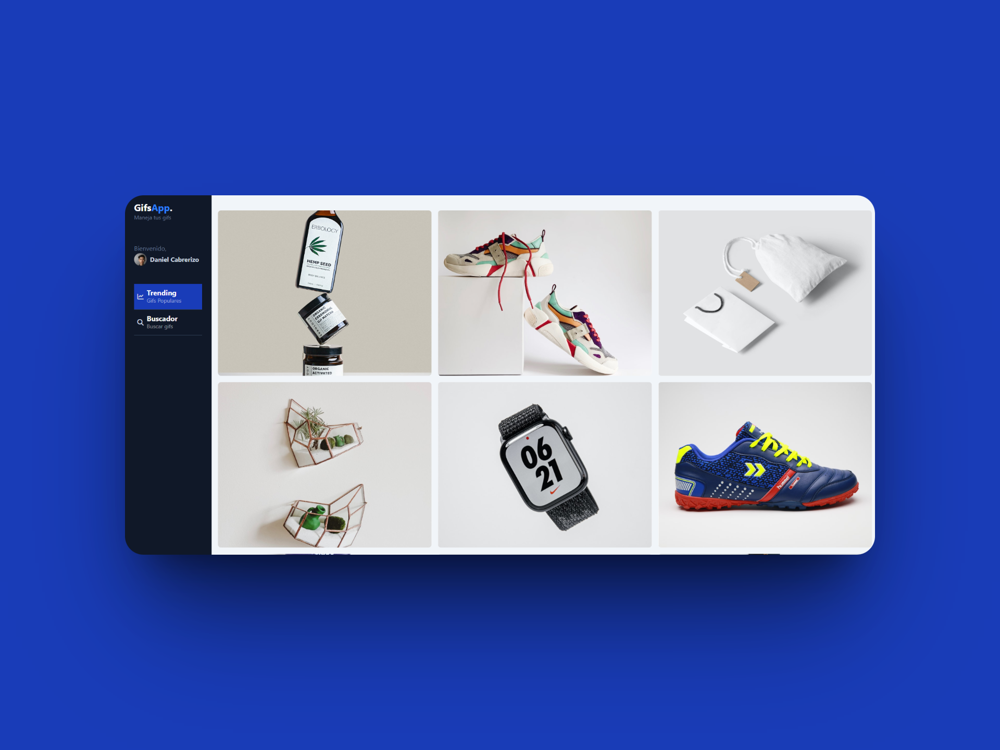

# 📷 GifsApp

GifsApp es una aplicación frontend que permite buscar y visualizar GIFs de manera rápida y sencilla.  
Este proyecto está enfocado en mejorar mis habilidades de desarrollo frontend, trabajando con **Angular** y buenas prácticas de programación.

---

## ✨ Características

- 🔍 Búsqueda de GIFs en tiempo real.
- 📂 Historial de búsquedas para fácil acceso.
- 🎨 Interfaz limpia y responsive.
- ⚡ Consumo de API externa de GIFs (ej. Giphy API).

---

## 🛠️ Tecnologías utilizadas

- **Angular** (framework principal)
- **TypeScript**
- **HTML5** + **CSS3**
- **RxJS**

---

